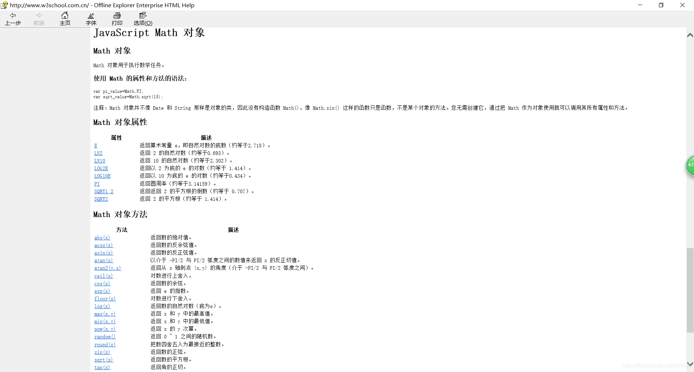
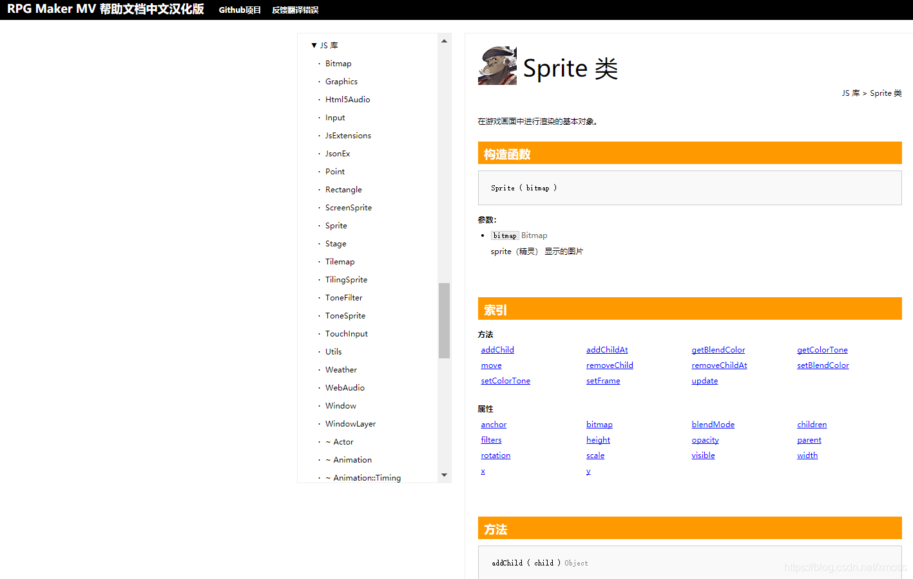
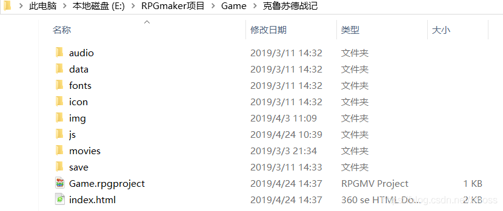

# 01.前期准备以及RPGMAKER内建逻辑
## 引言
这是一篇既有干货，又接地气的教程，能够帮助你快速达成以下目标
+ 1.了解RPGMAKER MV插件内在机理；
+ 2.将所学的语法知识运用于实战；
+ 3.制作出自己心仪的游戏！

本人作为之前只学过C++的学生，为了完成作业主动钻研，拜读了很多大神的博客，
然而他们大多存在着只是讲清用法，却不教会读者如何探索，自我学习的过程，
所以我结合自己的艰难求索之路，尽力用生动的语言告诉读者我是如何学习的，
通过这个过程的讲解，使得读者具有举一反三的能力。

## 1.1前期准备
### 1.1.1读者
+ 1.作为读者，你需要熟练掌握``JavaScript``基本语法，
本篇博客主要讲插件，中间遇到与插件制作密切相关的知识比如原型链会简要提到，但并不会详细讲，
建议读者到B站上搜索``JavaScript``教程学习，作为解释型语言，其比C++容易掌握，如果有相关基础可以快速入门。
其中对于插件制作较为重点的内容有：this指针，数组，函数与方法，原型链，json表；至于网页编辑才要用的DOM之类的可以不学。

+ 2.需要初步了解``RPGMAKER MV``的基本知识，即游戏引擎中不需要自己动手写代码的部分；

+ 3.插件怎么安放，插件怎么运行，插件头几行注释和一些相关参数是什么含义有人解释比我更清楚，这里推荐大家看一下@地球上的大海的相关博客

### 1.1.2工具
+ 1.毫无疑问，RPGMAKER MV（注意其它后缀的RPGMAKER不一定是用JS语言的，
RPGMAKER有许多版本，注意你选择的是哪种，目前来说MV是最先进的），
我们之后简称其为RPGMAKER或者RM；
+ 2.一个用来写代码的软件，JavaScript专用的有HBuilder（适合网页编辑）等，
本人用的是VS2013，对于制作插件足够用了（理论上记事本也可以写代码）；
+ 3.W3School离线手册，使用它主要是可以找到JavaScript语言中对象的自带方法，
比如数组方法[Array]和数学方法[Math]都经常需要在那查找；

+ 4.RPGMAKER官方帮助文档中文版（上网搜一下可能有，这是许多大佬翻译的，有时进不去），
选择JS库，可以看到RPGMAKER核型代码中定义的所有对象，并查询它们的属性与方法。

如果不介意看英文（或者找不到中文文档），可直接在引擎界面点击键盘``F1``，跳到英文文档界面，
选择``JS library``。读英文更有利于你的编程。

+ 5.我开了一个专栏提供一些供读者查阅的帮助文档，如精灵对象属性方法的解析，
内容根据本人自己的理解整理，如有错误还请指出，随缘更新，见“插件制作辅助工具书”专栏。

## 1.2 RPGMAKER内建逻辑
### 1.2.1游戏到底是怎么搭建的？
先说什么是游戏引擎吧，在很久以前，游戏是用纯代码敲出来的，
这样就有人想，同类型的游戏很多功能是相同的，比如控制角色移动，或者射击游戏的射击系统，
为什么不能把代码封装起来，游戏需要用到的功能模块就像搭积木一样搭上去不就行了吗？

于是游戏引擎应运而生，虽说引擎，但并不是说缺少它游戏就不能发动，
它更像是一个脚手架和一堆砖块，就等着你怎么将其垒成楼房，而不用管脚手架怎么搭，或者砖块怎么烧。

因为有了引擎，游戏制作更加简单方便，也不用每个人都去涉及晦涩的底层代码，
有了游戏引擎，游戏制作才能不断进步，让上百GB的游戏成为可能。

RPGMAKER顾名思义，是用来做RPG游戏的引擎，这款引擎上手简单，
但是由于较老，缺少很多现在的主流功能，
所幸，这个引擎专门预留了插件接口，可以让我们接入插件，实现更多功能，没有做不到，只有想不到。
要想做好插件，得先明白内建逻辑，接下来，我来带大家认识一下。

### 1.2.2游戏文件夹里的内容
当你新建一个项目时，就会获得一个大小上百兆的文件夹（打开引擎，在菜单栏选择“游戏”–“打开文件夹”即可快速打开）。

JavaScript的一大特点就是万物皆对象，除了五种基本数据类型外，各种内容都是以对象形式存储，处理，
这些JS库就内建了游戏中需要用到的所有对象，先让我们认识一下它吧。
+ 1.audio,movie
存储音频和视频的文件夹
+ 2.data
存储游戏数据的文件夹，以``json``表的形式存储，
存储如技能描述，角色描述，地图描述等内容
（为什么叫“描述”，这个问题将在以后的“临时数据与系统数据”模块讲解）
+ 3.img（即image的缩写）
用来存储游戏中的位图文件
+ 4.js
核心代码，其中包括JS库代码以及plugin（插件）代码
+ 5.save
游戏存档文件夹

### 1.2.3 JS库中的内容
点开js文件夹，你会看到如下几个js文件，
这些就是引擎制作者给你搭好的脚手架，里面定义了各种游戏中的各种对象以及其方法，
这时候你应该知道插件该干什么了吧？

插件就是要重写这些方法，让它们保留原有的功能基础上夹带一些自己的“私货”，
这些我都会在第三节详细讲述，接下来先让我们认识一下这几个文件究竟是干嘛用的吧。
+ windows
官方解释：游戏中所有窗口的原型
+ scenes
官方解释：游戏中所有场景的原型
+ spirites
官方解释：精灵类，具有显示动画特性的对象

以上三种对象我在第六章里详细解释
+ managers
顾名思义，管理者。

想象你的游戏是一个巨大的学校，你作为一个校长，不可能包干所有事，你只会管理，
但是你不会数学，不会语文也不会英语。

有一天你说，我要举办一个数学比赛，那你也只能去找数学老师，
没办法，你不知道怎么出数学题。

在这个游戏中，你说，我要设置一个方法，当执行这个方法时，就获得1000金币，
然而你并不知道金币存在哪个房间（金币放在哪个原型链），
也不知道怎么找到获得金币的方法（能够直接修改金币数据的函数）

所幸，你有一大群管家（managers）正在待命，你说：“有哪个管家是管金币的？”，
这时物品管家（ObjectManger)跳了出来说：“是我”，你问：“你都会干什么？”，
他抖了一篮子他会干的东西（通过查源码或者官方帮助文档可以知道），
很明显，这家活只会管理物品，是个专业型人才，
其中有一项技能（方法）就是修改金币的数量。

于是好了，你就可以告诉他，当你说“恭喜发财”时，
你就要让我的金库多出1000金币（调用ObjectManger.GetGold(1000))，
这样，你根本不需要知道管家怎么得到的金币，金币放在哪，
你只需要找到他并对他下达命令即可。

``managers.js``就提供了这样一大堆忠心耿耿的管家，包括数据管家（DataManger），
位图管家（ImageManger），物品管家，配置管家(Config），
存储管家（Storage），音频，视频，文本管家，场景管家（Scene)，
战斗管家（Battle），插件管家（Plugin）。随心所欲使唤他们吧。

+ plugin
一个用来存储插件配置的文件，作用和构造和json表差不多，
当你修改了“插件管理器”的内容，代码层面的变动就发生在这个文件

## 1.3 内建逻辑
根据我的理解，游戏运行时，代码执行过程如下
+ 1.调用核心代码，这部分过于高深暂时无法理解；
+ 2.生成好场景中包含的精灵对象，生成场景，场景压入栈底，
如果出现窗口则将其入栈，栈堆最上层的窗口显示，退栈表现为窗口关闭，
入栈表示窗口打开，场景切换时栈堆被重置；
+ 3.选择新游戏或者继续时，调用save.js里的数据加载存储数据，
游戏运行中不断加载临时数据，调用场景的JS建立游戏场景，游戏开始。

上述只是最简单的浅层理解，但是我们暂时还不需要知道太深的内容，
当你逐步摸清源代码时，你就自然地对游戏架构有清晰理解了。

## 如何自学
大家学习插件，要多琢磨别的作者写的源码，想看书一样多读多想，自然就学会了，
这里推荐论坛"project 1"，去上面下载些代码看看，自己写上注释从而达到理解，
许多优秀的源码不仅教会你基础知识，也能教会你编程的一般思想。

此外，还要结合别人写的代码，查看对应的引擎源码，这样可以完全了解一整块的知识。

这是我的学习方法，以供参考

## 附录：一些可能遇到的问题补充，不断完善中
+ 1.插件显示文字时出现乱码
我是用VS2013进行编辑的，给出相应的解决方案：
打开JS文件，选择：文件——高级保存选项——编码选择Unicode(UTF-8 无签名)即可。

+ 2.函数未定义错误
出现``cannot read propety ‘call’ of undified``或者
``undified is not a function``错误一般是有些函数未定义，
这时可以在你以确定没问题的位置放alert(你认为可能有问题的函数)
（或者直接在全局的位置放，因为全局函数优先调用）
，然后打开调试就可以知道到底那个函数是否定义，定义得怎样了。

