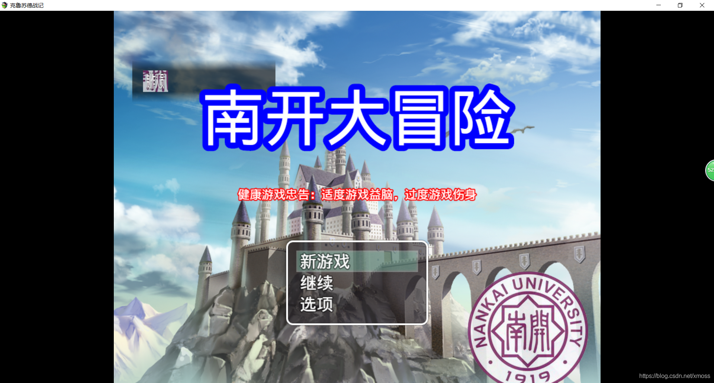

# 03 重写方法（一）：命名空间

接下来就进入到编写插件最重要的部分了，那就是方法重写。

前面我已经讲过方法了，在RM中，方法储存在一个个功能各异但是同根同源的对象中，
然后游戏就是通过对象实例化，调用对象方法，实现游戏的各个功能。
（这里要为大家区分一下静态类与非静态类，静态类指全局唯一的对象，不能也不需要实例化，作用域为全局，
比如角色，技能，地图这些共用的对象，都在RM中定义为了静态类）

## 4.1 为什么插件制作核心在于重写方法？
我将举个例子帮助大家理解：

现在你有一个用清一色形状相同红砖砌成的简陋房子（就是RM自带的简陋代码），你想要把它改装成一个造型独特的建筑。
你并不会烧砖，所以只能对这栋房子原来的红砖进行改造，夹带私货。这就涉及重写方法的几个问题：
+ 1.不自己烧砖（你很难从头写出与官方代码完全兼容的代码）；
+ 2.只是对原有砖头改造（继承原型链）；
+ 3.不要把全部砖都搞成一个样子（设置自己的原型链，尽量不要覆盖全局代码）。

## 4.2 为什么不要覆盖全局代码
因为我们的插件可能只是在某些方面需要用到，而系统定义的对象往往是全局使用的，
比如精灵对象，你想建立一个可以闪烁的精灵放在开场界面里面，但是并不是整个游戏都需要闪烁的精灵。
```js
Sprite_Base.prototype.update = function() {
    Sprite.prototype.update.call(this);
    this.updateVisibility();
    this.updateAnimationSprites();
    this.flashing();    //你在系统源代码中插入的“私货”
};
```
假设你就直接在源代码``sprite.js``中的``Sprite_Base``的刷新函数（就是每隔一帧就会执行一次的方法）
加入一个自己定义的“闪烁”函数，那么以后所有通过``new Sprite``获得的对象都会继承这个方法，
由于整个游戏的精灵都是继承这个对象，那么就导致整个游戏的精灵都会闪烁，这可不是我们最初想要看到的结果。

当然，事情也没有绝对，有时候重写方法是要覆盖掉系统原有方法的，
我们把这种重写方式叫做``覆盖式重写``，另一种叫做``复制式重写``

## 4.3 如何优雅地进行重写。
### 4.3.1 以建立对象的形式设置命名空间

为了方便记忆和使用，被我们夹带私货的那些函数一般和它们的原函数起相同或者相近的名字，
为了防止冲突，我们需要给它们各自的命名空间以便与主函数区分。

如果学过C语言，就会知道C语言是用``using namespace<空间名>``这种编译预处理方式来设置命名空间。
而在JavaScript中，并没有预处理这种机制，但是JavaScript有着“万物皆对象”的特点，利用这一点，
我们可以想到**使用对象来充当命名空间**。
```js
var MyName = MyName || {};                                 //创建一个构造函数，如果存在就不用创建
MyName.Parameters = PluginManager.parameters('UiName');    //将这个插件中的变量放入一个命名空间中
MyName.Param = MyName.Param||{}                            //设置构造函数存储参数
MyName.Param.UI = String(MyName.Parameters['图片的名字']);   //用字面量将图片nk放到参数中
```
以上面这行代码解释创建命名空间的方法与通行的规则。
+ 第一行：``var MyName = MyName || {};``
从后面的花括号就可以看出，"MyName"应该是使用字面量来创建的函数，
既然我们是需要对象，那么这个函数在之后肯定是会起到一个构造函数的作用。

但是``MyName||``又是什么意思呢？对于JavaScript的或运算符，
运算规则是先判断前面的运算数是否为真，如果为真，就会跳过后面的运算数。

所以这里的意思是：“如果已经存在了"MyName"这个构造函数，那么就不做任何改变
，如果不存在，就定义它为一个函数。”这种处理的目的是为了防止重定义。

（注：以下三步主要是针对需要使用插件变量的情况，如果不需要使用，就不用写）

+ 第二行：``MyName.Parameters = PluginManager.parameters(‘UiName’);``
这里出现了Parameters（参数），也就是说我们新建的对象中出现了Parameters这个属性，
那么小朋友肯定要问了，这是属性是哪来的啊？我们不是才刚创建这个对象吗？

其实啊，这个属性是所有对象都共有的，前面已经说过所有对象都继承了祖宗对象Object的属性，
而这个Parameters就是从那里继承过来的，虽说你用它存什么乱七八糟的东西都可以，
但是我们一般都使用它存储插件定义的变量（在第二篇博客中提到）。

至于``PluginManager.parameters(‘UiName’)``，根据前面的学习，小伙伴们很容易就可以理解了，
就是调用“插件管家”中的``parameters（参数化）``方法，并以``UiName``这个字符串作为实参（如果不知道为什么字符串可以作为形参请学习”变量字面量“）。
所以这里的意思是:
将``plugin``这个文件夹里那个叫做``UiName.js``的文件里定义的参数存储到``MyName``对象中的``Parameters``属性里。

+ 第三行：``MyName.Param = MyName.Param||{}``
我们知道，JavaScript中，数组和函数都可以用来存储数据，比如``plugin.js``是用数组存储的，
json表是用函数存储的，用函数存储，一般是用于储存对象，也就是说可以以调用对象的方式调用属性，这里用的也是这种方法。

+ 第四行：``MyName.Param.UI = String(MyName.Parameters[‘图片的名字’]); //用字面量将图片nk放到参数中``
String是字符串转化函数，将各种数据类型转化为字符串。
前面parameters中获得的各种变量如果都需要用它们的原名调用起来可能比较麻烦，因为它们的名字甚至有可能是中文。

这里通过字面量转化，将Parameters对象中的各种变量储存在Param这个空间中方便调用
（除了用String函数转为字符串，还可以用Number等转为其它类型）。这样处理主要是为了方便，例如：
```
 * @param 图片的名字
 * @desc the picture of paper
 * @picture
```
当你想要调用这个变量时，你可以输入
```
MyName.Parameters['图片的名字'];
```
也可以输入
```
MyName.Param.UI;
```
很明显后者更加方便，所以大规模工程时，通常对插件变量进行这样的转化，以便调用，
当然如果只是小插件你当然可以不这样折腾。

### 4.3.2 复制原型链（拜师学艺）
前面说过了，我想要获得一个不断闪烁的精灵，那么我就得对精灵对象下手，对其进行改造，
为了防止冲突，我在自己的命名空间复制出一个精灵，再对其进行处理。复制过程如下：
```js
function MySprite() {                                
    this.initialize.apply(this, arguments);  
}
MySprite.prototype = Object.create(Sprite_Base.prototype);  //复制Sprite_Base的原型链
MySprite.prototype.constructor = MySprite;
MySprite.prototype.initialize = function() {
}
```
这一段涉及较深的原型链知识，但还是大家不用搞懂，需要时候复制粘贴然后改个名字用就行了，
通过这段语句，``MySprite``类向``Sprite_Base``类拜师学艺，
从此``Sprite_Base``拥有的方法和属性``MySprite``都拥有了，相当于复制了一个``Sprite_Base``。

## 重写方法（魔改函数）
好啦，为了实现先前说的闪烁精灵，我们就要对``MySprite``下手了。
那么该从何下手呢，这个时候很多人大脑都一片空白，既然我们要改写方法，那么就得先知道这个对象有哪些方法。

建议大家先用官方文档进行大致了解，然后再打开官方源代码仔细阅读``Sprite_Base``这个对象的函数，看看哪些是应该改动的。
通过查找，以下的“update”函数可以修改：
```js
Sprite_Base.prototype.update = function() {
    Sprite.prototype.update.call(this);
    this.updateVisibility();
    this.updateAnimationSprites();
};
```

这个函数就是每一帧刷新执行的操作，那么我们就想，如果没刷新一帧，精灵的透明度就减少或者增加，不久实现闪烁功能了吗？
于是我们对MySprite进行如下修改：
```js
MySprite.prototype.update = function() {
    Sprite.prototype.update.call(this);
    this.updateVisibility();
    this.updateAnimationSprites();
    //以下私货
    var couting=ture;
    if(opacity==0)
    	this.couting=!this.couting;
    if(couting==0)
    	this.opacity--;
    else
    	this.opacity++;
};
```
这样你你的MySprite类就具有了闪烁的特性。接下来只需要用它实例化就好了。

南开图片就是一个在闪烁的精灵啦

下一篇将介绍两种适用于不同场合的重写模式，复制式重写和覆盖式重写。
