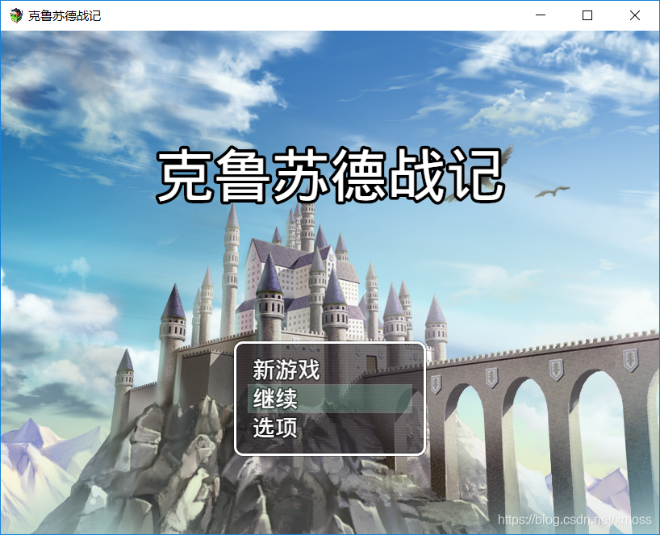
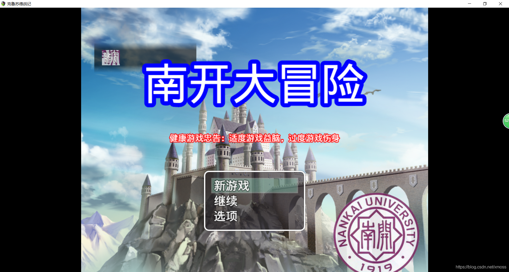

# 重写方法（二）：call函数，apply函数，覆盖式重写与复制式重写
上一节我们大致了解了重写方法是什么概念，但是不要着急，
你还需要知道如何用call函数和apply函数来减少你敲代码的工作量，
以及不同场合需要使用哪些不同的重写模式。

## 5.1 call和apply
JavaScript中有一些函数是全局函数，是所有对象都可以调用的，
其中``call``和``apply``就是这样的函数，它们一般在函数体中调用，
可以很方便地完成方法复制。其调用方法如下：
```js
// 定义一个person1类，这个类有sayName方法可以输出它的name
person1 = {name:"孙悟空"}
p1 = new person1;
person1.sayName = function () {
    alert(this.name);
}
p1.satName();    //输出“孙悟空”

// 定义另外一个类person2
person2 = {name:"猪八戒"}
p2 = new person2;
person2.sayName = function () {
    person1.sayName.call(this);   //将person1的方法在person2的方法中调用。
}
p2.sayName()  //输出“猪八戒"
```

可以看到，call函数就是复制方法，但是和单纯的复制又不一样，
它可以将this指针转为当前函数体的this指针，
原本在person1中this指针指向孙悟空，在person2中this指针就指向猪八戒。

稍微想一下就知道，这个函数和复制原函数函数体到新函数中实现功能是一样的，那为什么需要这种函数呢？
+ 1.很多底层代码你很难找到它们放在哪，当是你只要知道它们的功能是什么，就可以用call函数快速复制，
比如你想修好你的电脑，你很多时候并不需要辛辛苦苦学习电脑到底怎么运行，
你只需要去买新的配件把坏的换下来就可以了，call和apply函数就提供了这种便利。
+ 2.为了代码好看，并且层次更加清晰

``call``函数和``apply``函数区别在于传入实参的方式不同，``call``是一个一个传入，
``apply``是以数组形式传入，``apply``函数在传入大量实参时比call函数更有优势。

## 5.2 覆盖式重写
顾名思义，就是把系统主函数覆盖掉的重写方法。

RM的代码执行时，是先执行系统主函数，也就是核心代码，之后再执行插件里的代码，
很显然，如果你在插件中定义了与系统自带函数名相同的函数，就会使用你定义的函数，从而实现覆盖。

举个实例，假如我想给游戏标题后面加上副标题，原界面如下。

你刚开始不知道副标题怎么加，但是你可以把副标题加在生成主标题的函数里。

于是在``scenes.js``中找到这段生成游戏开始界面的代码。
```js
//这段代码用于绘制游戏主界面中的名称
Scene_Title.prototype.drawGameTitle = function() {                    
    var x = 20;
    var y = Graphics.height / 4;
    var maxWidth = Graphics.width - x * 2;
    var text = $dataSystem.gameTitle;
    this._gameTitleSprite.bitmap.outlineColor = 'black';
    this._gameTitleSprite.bitmap.outlineWidth = 8;
    this._gameTitleSprite.bitmap.fontSize = 72;
    this._gameTitleSprite.bitmap.drawText(text, x, y, maxWidth, 48, 'center');
};
```
接下来在我们自己的插件中写下
```
//定义一个函数，将原函数复制下来
var substitute=Scene_Title.prototype.drawGameTitle;   
//重写系统函数
Scene_Title.prototype.drawGameTitle = function () {
    substitute.call(this);  
    var x = 20;
    var y = Graphics.height / 4 + 128;
    var maxWidth = Graphics.width - x * 2;
    var text = "适度游戏益脑，过度游戏伤身";     
    this._gameTitleSprite.bitmap.outlineColor = 'red';   //颜色改为red
    this._gameTitleSprite.bitmap.outlineWidth = 4;       //宽度改为4
    this._gameTitleSprite.bitmap.fontSize = 20;          //字号改为20
    this._gameTitleSprite.bitmap.drawText(text, x, y, maxWidth, 48, 'center');
}
```
这里的call函数相当于将系统原函数调用了一次，保证原本的基础功能，比如生成游戏主标题都正常运行，之后再修改一下生成主标题的代码段写自己的副标题。

覆盖式写法主要运用于：

该函数在系统中不被继承，是``末端函数``，比如开始界面，战斗界面的生成，背包系统，技能系统等

## 5.3复制式重写
复制式重写在前一篇教程中已经举了闪烁精灵的例子了。
将在下一篇以实例的形式介绍复制式重写。

