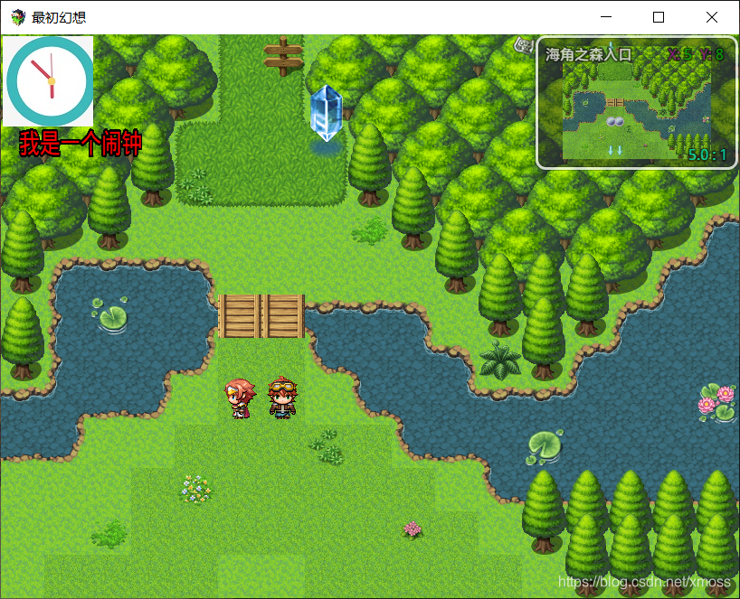
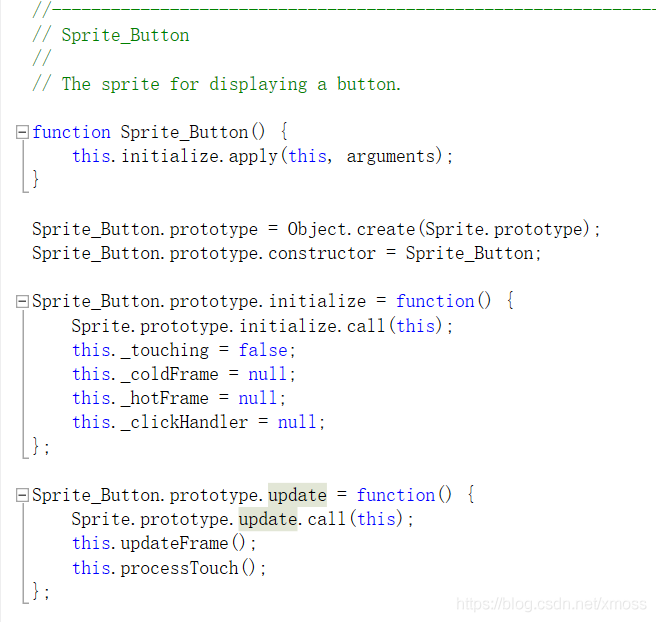

# 06.重写方法:在场景中创建精灵,复制式重写的实例教学
因为要开新坑了，准备连续更新把这个插件制作的坑填完，
之后更新的是“可交互精灵——事件绑定教学”，“窗口（windows)教学"，"自动战斗AI实现——学会自我挖掘引擎功能”。

本文通过在地图场景创建精灵对象的实例，让读者学习复制式重写的基本使用方法，能够通过位图文件和位图对象创建精灵。
同时会帮助大家辨析几个比较容易混淆的概念：``场景scenes``，``窗口windows``，``精灵sprites``

## 6.1 辨析场景（scenes），窗口（windows），精灵（sprites）
打开文件夹发现这三种对象都各自有一个JS文件来创立，这几个概念大家是容易搞混的，这里我直接帮助大家区分：

+ scenes：游戏运行时最底层栈所显示的对象，就像一块一样画板，是各种精灵（颜料），窗口（画布）对象的活动场所，
切换场景时，应该是把原先的场景清除出栈，再载入新的场景。

常见的有：
    + “基础场景（Scene_Base）“
    + “开始界面场景（Scene_Title）”，
    + ”地图场景（Scene_Map，主角在大地图上活动的场景）“，
    + ”战斗场景（Scene_Battle，进入战斗后的场景）“
    
+ windows：基于场景，跳出后覆盖场景，只能对于位于栈顶的窗口进行操作，
退栈之后退回到上一个窗口或者场景，就像在一块画板上铺一层画布。
常见的有读取存档窗口，角色属性窗口，背包窗口。
+ sprites：看到精灵，大家都会想到是个轻盈，可以到处飞的小家伙，
精灵就是可以存在于各种场景，窗口上面，又不影响其运作的东西，而且精灵的功能非常多，
可以作为图标，按键，角色等等，是我们最常用的对象。

接下来我将复制一个精灵，并将其安放在地图场景中，来教大家复制式重写，以及精灵，场景对象的运用。

## 6.2 代码逐段解析
下图是这次的目标，在大地图场景中的左上角放一个闹钟图片精灵和一个文字精灵，Let’s go！

实现上图效果，在地图场景中的左上角插入一个时钟图像, 以及一串文字。

我将逐段解析，大家最好打开项目跟着我的指导做，自己键入代码，写上注释。

### 6.2.1 前期工作——设置命名空间，插件参数
为了让大家养成良好习惯，还是要写一下命名空间，对于较小的插件，创建的命名空间就和插件名称一样即可：
```js
//==================================================
//spriteTest
//===================================================
/*:
 *@plugindesc 精灵，位图，场景实验插件
 *@author 进入盛夏之门
 *
 *@param text
 *@desc 这是显示的字符段
 *@default 我是一个闹钟
 *
*/

// 建立命名空间，用于储存这个插件用到的插件变量和函数
var $spriteTest = $spriteTest || {};
//将这个插件中的变量放入这个命名空间中
$spriteTest.Parameters = PluginManager.parameters('spriteTest');
//设置构造函数存储参数插件参数（即上面的text参数）
$spriteTest.Param = $spriteTest.Param || {}
```

按套路写好插件头，创立命名空间，我这里命名空间只是用来储存text这个插件变量，
这样子方便在引擎界面修改，严格来说，**插件中自建的函数一般都要放在命名空间的原型链上，不然会出现大量全局函数**，
我这里出现了一些奇怪的BUG有些函数没放在原型链上，但是我编的其它插件没问题。

### 6.2.2 复制系统的精灵类，构建专属精灵类
```js
// 我们对系统提供的精灵类进行复制，创建一个"mySprites"
function mySprites() {
    this.initialize.apply(this, arguments);
}
mySprites.prototype = Object.create(Sprite.prototype);
mySprites.prototype.constructor = mySprites;
mySprites.prototype.initialize = function () {
    Sprite.prototype.initialize.call(this);
    // 以上为固定写法，不需要弄清楚
    // 以下是设置这个精灵类的共同属性，所有这个对象构造的精灵都具有的属性，类比C++中的类
    /* 设置框架，即精灵所处矩形范围，精灵的活动区域被限制在此框架内，四个参数分别为左上角的X,Y的坐标，宽度（横），长度（竖）
    需要注意的是X和Y一般是负数，如果大于0图片就会往屏幕外移动 */
    this.setFrame(0, 0, 100, 150);
    //运行创造子精灵的函数
    this.createAll();
    //绘制位图（bitMap）的文字函数
    this.drawText();
    //move作用和setFrame是一样的，两个数值相当于把框架沿x轴y轴移动多少单位
    this.move(20, 10);
};
```
这里就是用我前面提到的复制式重写方法，为了不影响其它精灵对象的运行，我们复制了一个精灵对象，
其继承的是"Sprite"类的属性和方法，我们在构造函数就对其进行修改，设置初始值，也就是这个类mySprites的共同属性。

有人可能觉得new一个新的精灵对象后再进行一些调整更加方便，但是如果这个是个需要反复使用，
且具有共同特点的精灵时，复制式重写就更加方便，并且这样利于代码调试。

这里``createAll()``函数将在后面定义，作用也是创建精灵，之所以这样写,
是我为了可以通过``new``一次``mySprites``创建两个精灵，这样做是基于一个精灵可以作为”容器“包含多个子精灵。

一般来说不会在构造函数中套娃，易于理解的方式如下：
```js
function mySprites() {
    this.initialize.apply(this, arguments);
}
mySprites.prototype = Object.create(Sprite.prototype);
mySprites.prototype.constructor = mySprites;
mySprites.prototype.initialize = function () {
    Sprite.prototype.initialize.call(this);
    // 在这里写上精灵的专属属性
}

// 在这里定义精灵的其它方法

//分别创建多个对象
var object1=new mySprites(bitMap);
var object2=new mySprites(bitMap);
```
系统中其它精灵的构造大多是这样的，如：



我们这里使用另外一种方法构造精灵，即套娃式构造。

### 6.2.3 具体的精灵对象创建
```js
mySprites.prototype.createAll = function () {
    // 使用图片来建立精灵
    this._clock = new Sprite(ImageManager.loadBitmap('img/pictures/', "clock", true));
    // 使用系统提供的位图对象建立精灵,这里使用的是一个空位图，具体的文字会用drawText函数上描绘
    this._cont = new Sprite(new Bitmap(240, 200));       //定义位图的宽和高      
    // anchor，范围0-1，设置精设置绘制精灵的起始坐标，0.5可以令其居中显示
    this._clock.anchor.x = this._clock.anchor.y = 0.5;         
    /*这里的setFrame是精灵中的精灵活动范围，低级精灵不能超过其容器活动范围，不然无法显示
    _clock精灵属于mySprite类，其活动范围不能超过他的类，如果不setFrame，系统将会给一个默认值*/
    this._clock.setFrame(0, 0, 100, 100);
    this._clock.move(32, 42);                         
    this.addChild(this._clock);
    this.addChild(this._cont);
};

//这里定义了一个函数，是用于对前面构建_cont精灵所用位图进行描绘的
mySprites.prototype.drawText = function () {
    this._cont.bitmap.fontSize = 30;    //设置字型大小
    this._cont.bitmap.textColor ="rgb(0,0,255)"||'red';  //设置字体颜色，可用RGB表示法或者英文字符
    //'' +：根据JavaScript语法规则，可以将后面的数据强制转化为字符串，这里$spriteTest.Parameters.text原本就是字符串，这样做法是为了防止出错
    var text = '' + $spriteTest.Parameters.text||"我是一个闹钟 ";  //设置文本
    this._cont.bitmap.drawText(text,0, 88, 136, 44);
}
```
创建精灵对象的方法是:``new Sprite(位图对象)``，这其中的位图对象：
+ 一可以是储存于游戏根目录下的png图片，其导入方式是分别以字符串的形式写下它的路径，文件名，后面的实参我尚未搞懂。
+ 二可以用系统提供的位图对象创建，格式如代码所示，这里需要注意，使用位图对象可以”先斩后奏“，用它构建完精灵后再进行描绘。

上面我的文本使用的是插件变量。

### 6.2.4 进行创建精灵触发
我们虽然定义了一个精灵，但是发现并没有触发创建这个精灵的操作，即我们需要new一下这个精灵。
这里的触发方式有很多，包括插件指令触发，按键触发（下一章讲），特定场景触发，我们这里采用最后一种：
```js
SUBupdate = Scene_Map.prototype.update;
Scene_Map.prototype.update = function () {
    SUBupdate.call(this);
    this.myMapSprite = new mySprites();
    // 前面已经说过，在构建对象的函数里面已经设置了对象初始值，这里就不需要再设置了
    this.addChild(this.myMapSprite);
    // 用addChild函数将精灵加入场景中
};
```

这里也用到了覆盖式重写，大家需要注意，我们要选择在正确函数内触发，
我们要在大地图上显示，就不能在``Scene_Base``或者``Scene_Battle``中重写，
而且我们需要每一帧都维持这个精灵，这就需要将其写在update函数上。
