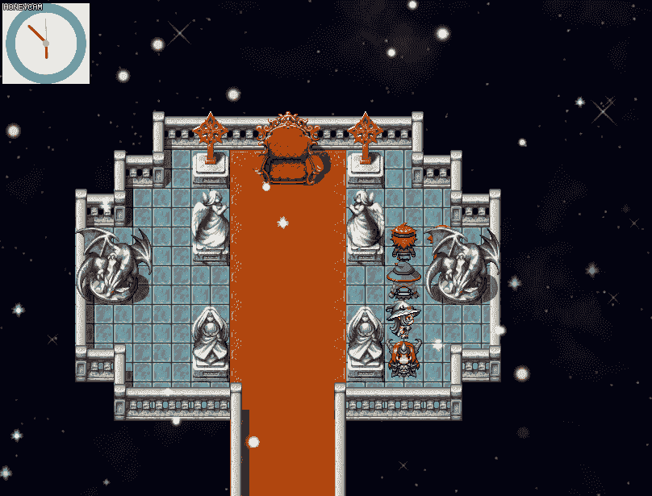
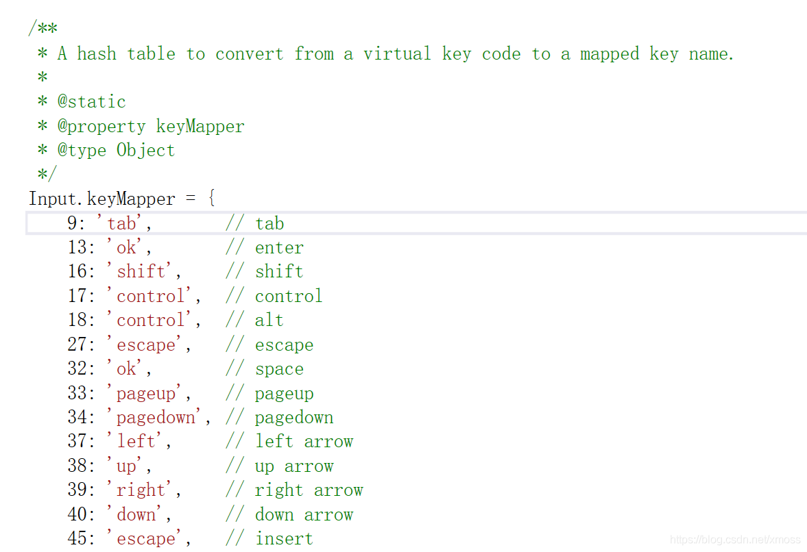
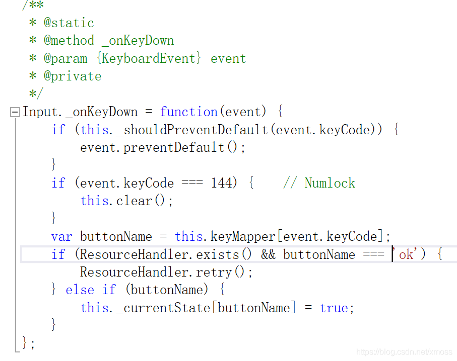
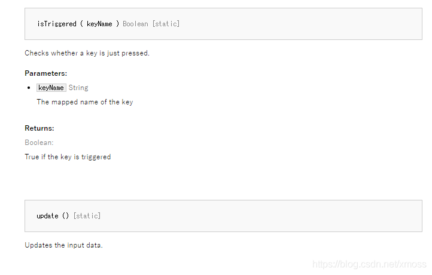

# 07.可交互对象:键盘指令
这篇博客介绍一下几个常见的方法与精灵进行交互，这些方法同样可以用于场景交互，
窗口交互，学完之后可以很容易地举一反三。

无论什么交互过程，我都大致将其分为四个部分，
+ 信号约定（什么指令可以发生交互）
+ 信号监测（判断是否有信号输入，哪个信号输入）
+ 信号输入
+ 事件响应（交互后运行什么方法）几个部分。

比如调用插件用的插件指令，信号约定和信号监测就是声明插件指令，
信号，信号输入放在事件编辑器里，事件响应放在其它函数或者直接和信号约定放在一起。

常见的交互方法有使用插件指令，键盘指令，鼠标指令等，插件指令大家应该入门的时候已经了解了，这里介绍后面两种。

文章除了教会读者代码怎么写，意思是什么，还分享我自己的学习经历，以供参考。

这次我们要实现的目标是在场景地图显示一个简单的精灵对象，通过点击键盘上的“N”可以让其反复出现消失，如图：


## 7.1 建立命名空间，准备相关变量
```js
/*=======================================
controller.js
===================================*/
/*:
*
* @plugindesc 控制精灵演示插件
* @
* @author 进入盛夏之门
*
* @param keyVal
* @desc 快捷键键值（键盘N键是：78）
* @default 78
*
*/

//常规工作——设置命名空间
//当需要管理多个命名空间时，使用作者名缩写+子空间名更加规范
var JRSXZM = JRSXZM || {};  
JRSXZM.controller = {};
JRSXZM.controller.parameters = PluginManager.parameters('controller');
// 这是个用于判断当前是否需要精灵的变量，更规范的写法是用一个函数储存
JRSXZM.controller.isShowSprite = 1;
```
当我们自己编辑插件变多时，使用更规范的``作者名缩写+子空间名``更有利于管理。

在设定命名空间的位置准备一些判断状态的函数或者变量，
一般情况下，这些内容放在函数里，这里由于判断比较简单就直接用一个变量。

## 7.2 定义一个简单的精灵
用上一章的方法，我们可以很轻松地定义一个简单地精灵类，注意，
我下面的代码使用的类名与上次相同，大家写的时候不能在不同插件里重复定义两个同名类。

```js
//用复制式重写定义一个简单的精灵
//我们对系统提供的精灵类进行复制，创建一个"mySprites"
function mySprites() {
    this.initialize.apply(this, arguments);
}
mySprites.prototype = Object.create(Sprite.prototype);
mySprites.prototype.constructor = mySprites;
mySprites.prototype.initialize = function () {
    Sprite.prototype.initialize.call(this);
    this.setFrame(-30, -30, 200, 200);
    this.createAll();  // 默认一开始就创建精灵
   
};

mySprites.prototype.createAll = function () {
    this._clock = new Sprite(ImageManager.loadBitmap('img/pictures/', "clock", true));
    this._clock.anchor.x = this._clock.anchor.y = 0.5;
    this._clock.setFrame(-30, -30, 200, 200);
    this.addChild(this._clock); //将子精灵_clock加入到容器mySprites中
};
```
## 7.3 消息约定
键盘的消息是怎么传入计算机的呢？
我们知道，键盘每个键位都对应一个键值，可以找到RM源码 ``rpg_core.js``中，一些键值和字符串绑定，我们可以猜到字符串就是约定的“指令”

这种格式大家可能没见过，简单地说就是以函数的形式建立对象，在JSON表中常用，这个对象中的变量可以用数组的形式调用，如:
```js
Input.keyMapper[9]=='tab';
```
仿照这种格式，我们给键位``N``绑定一个指令标志：
```js
//消息约定——设立键值
//这里给键值78绑定了一个标志“interact"
Input.keyMapper[JRSXZM.controller.parameters['keyVal']] = 'interact';
```
绑定了N，我们只是赋予其一个系统中的职称，就像”张三是个主任“，但是我们并没有告诉它要做什么，
所以我们得知道系统是怎么通过这个标志进行事件响应的，也就是“如果你是主任，你要做什么”

我们自然地想到从刚才地代码里面找，如搜索一下``ok``指令，可以找到：

从这段代码可以读出几个信息：
+ 1.键盘的响应可以通过 ``_onKeyDown``函数进行；
+ 2.输入的键值储存在对象``event.keyCode``中。

然而注释中写的``private``私有函数无疑泼了我们一桶冷水，
实际上，在此之外调用``Input._onKeyDown``或者``event.keyCode``都会报错。

但是没必要灰心，可能有多个函数都可以获得键值并且进行响应，
之所以不同是因为响应的时间或者条件不同。
而且我们已经大概知道要在Input对象里面寻找了。

可以直接在帮助文档中找到这个函数``Input.isTriggered(ketName)``：

找到这个函数就是找到下达命令的窗口，有了它，我们就可以对顶着``interact``头衔的N键下令了。

## 7.4 创建精灵
我们接下来先把精灵创建出来。

如果按照上次的经验，也把精灵初创建部分写在场景刷新函数（Scene_Map.prototype.update）里，
是会出问题的，问题就是精灵无论如何都保持着最初的状态，如下代码：
```js
//这是错误的反面教材
JRSXZM.controller.SUBupdate = Scene_Map.prototype.update;
Scene_Map.prototype.update = function () {
    JRSXZM.controller.SUBupdate.call(this);
    this.myMapSprite = new mySprites();
    this.myMapSprite.opacity = 255;
    this.addChild(this.myMapSprite);
    //下面是消息监测和响应部分，略
};
```
这是因为每一次刷新窗口，系统都重新创建一次精灵，这就意味着重新调用一次精灵初始化函数，
无限次死而复生，任凭你怎么处理都那它没办法（注：新创建的同名精灵会覆盖掉之前的精灵）。

所以我们要让精灵之初始化一次，也就是和窗口初始化一起进行：
```js
//精灵的构造正确方案
JRSXZM.controller.SUBcreateAllWindows = Scene_Map.prototype.createAllWindows;
Scene_Map.prototype.createAllWindows = function () {
    JRSXZM.controller.SUBupdate.call(this);
    this.myMapSprite = new mySprites();
    this.myMapSprite.opacity = 255;
    this.addChild(this.myMapSprite);
};
```
## 7.5 消息响应，消息监测
先设计一个精灵用来响应的方法。
这个方法是改变精灵自身的属性，所以写在``mySprites``的原型链里，如下：
```js
//消息响应——设置精灵用来响应的方法
mySprites.prototype.changeMySprite = function () {  
    if (JRSXZM.controller.isShowSprite == 1) {
        this.opacity = 0;
        JRSXZM.controller.isShowSprite = 0;
        }
    else {
        this.opacity = 255;
        JRSXZM.controller.isShowSprite = 1;
    }   
}
```
这时可以看出变量``JRSXZM.controller.isShowSprite``的作用是判定下一步是展示精灵还是使其消失。
让精灵消失的方法除了设置透明度外，还可将属性``visble``改为``false``，大家还可以发挥聪明才智看看精灵能做出用什么其它花样（如曲线运动）。

接下来设置消息监测。

消息监测必须在每一帧都进行，这样才能及时收到我们的信号，这就意味着要把它写在刷新函数里：
```js
//消息监测每一帧都要进行，所以放在刷新函数
JRSXZM.controller.SUBupdate = Scene_Map.prototype.update;
Scene_Map.prototype.update = function () {
    JRSXZM.controller.SUBupdate.call(this);
    //如果监测到键盘指令为“interact”，则执行响应函数
    if (Input.isTriggered('interact'))
        this.myMapSprite.changeMySprite();
};
```
