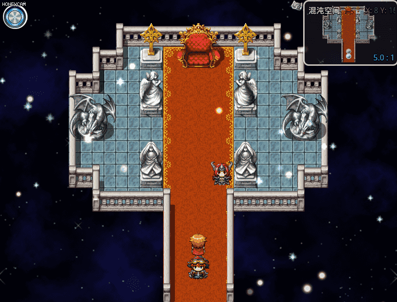
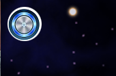
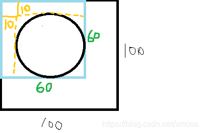
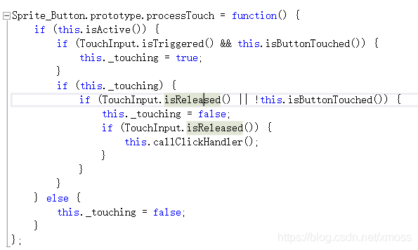
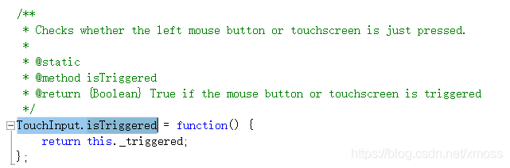
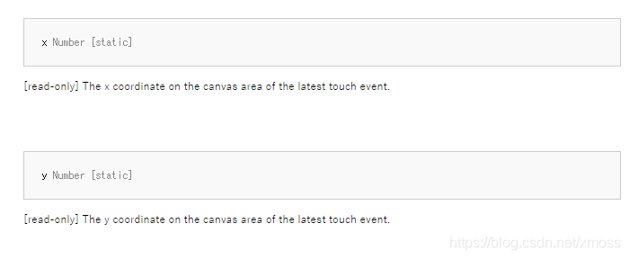

# 可交互对象（2）：鼠标指令触发事件
上一节我们学习了如何通过键盘的指令来控制精灵，那么这节的内容应该就好理解多了，
因为鼠标指令和键盘指令有很多相似之处，而且没有MFC编程中难以理解的句柄概念。

那我们还是按照交互的四个模块分别讨论：

+ 信号约定：设置鼠标点击区域；
+ 信号监测：获得当前鼠标点击状态（左键or右键，按下还是弹起，点击位置）；
+ 信号输入；
+ 信号响应。

为了帮助大家更好地理解精灵类，这回做得稍微复杂一点，实现真正地按钮效果：鼠标按下时按钮缩小，松开时按钮变大，同时触发一个事件，如下图：

大家快拿起键盘跟我来

## 1.创建精灵——绘图的艺术
首先我们找张作为按钮的图，一般网上找到的图都是过大的，
并且没有圆形的图（用方形做按钮太丑了吧），所以需要用PS修建一下，不会的自学，
像素一般设在``50 x 50-150x150``为佳，我下面用到的是一个50x50的位图。

因为要精确知道精灵所在位置的像素，来给鼠标设置点击范围，所以这回创建精灵就要有规划而不能盲目了。
```js
/*:
*
* @plugindesc 鼠标控制精灵演示插件
* @
* @author 进入盛夏之门
*
* @param uiPath
* @desc 按钮位图的存放路径
* @default  img/pictures
*
*/
//常规工作——设置命名空间
//当需要管理多个命名空间时，使用作者名缩写+子空间名更加规范
var JRSXZM = JRSXZM || {};  
JRSXZM.MouseControl = {};
JRSXZM.MouseControl.parameters = PluginManager.parameters('MouseControl');
//以上为常规的工作，可无视
//=======================
//用复制式重写定义一个简单的精灵类
//我们对系统提供的精灵类进行复制，创建一个"myButtonSprites"
function myButtonSprites() {
    this.initialize.apply(this, arguments);
}
myButtonSprites.prototype = Object.create(Sprite.prototype);
myButtonSprites.prototype.constructor = myButtonSprites;
myButtonSprites.prototype.initialize = function () {
    Sprite.prototype.initialize.call(this);
    this.setFrame(0, 0, 100, 100);
    this.createAll();  // 默认一开始就创建精灵
   
};
//写构造精灵的函数
myButtonSprites.prototype.createAll = function () {
    //下面是用插件变量来储存图片路径，如果插件变量未定义，默认找'img/pictures/'文件夹
    //注意每条路径间都要以/相连，下面得语句实际上是读取'img/pictures/Button’路径，不能缺少/
    this._button = new Sprite(ImageManager.loadBitmap(JRSXZM.MouseControl.parameters['uiPath'] + '/' || 'img/pictures/', "Button", true));
    //坐标起点设为原点或者不设默认为原点
    this._button.anchor.x = this._button.anchor.y = 0;
    this._button.setFrame(-10, -10, 60, 60);
    var pressCount = 0;//定义一个计数变量，后边要用
    this.addChild(this._button);
};
//在构造窗口时唯一构造精灵
JRSXZM.MouseControl.SUBcreateAllWindows = Scene_Map.prototype.createAllWindows;
Scene_Map.prototype.createAllWindows = function () {
    JRSXZM.MouseControl.SUBcreateAllWindows.call(this);
    this.myButton = new myButtonSprites();
    this.addChild(this.myButton);
};
```
附两张图帮大家理解这个精灵的位置与代码的关系


上述代码中对精灵起定位作用的是两个``setFrame``函数。

``myButtonSprites``构造函数中的``setFrame``用于构造大的``100*100``框架（黑色框），前面两个参数0，0设置了其子精灵起始坐标。

``this._button.setFrame(-10, -10, 60, 60);``是设置我们位图精灵的活动范围（蓝色框），
其从其父精灵设置的起始坐标``(0，0)``开始描绘，``-10``指将该精灵使用的位图（就是那个按钮）的起始坐标设置为``（10，10）``
这样就将精灵放在橙色蓝色框所在范围。

综上，我们知道了这个按钮现在的坐标，可以进行下一步了。
（关于精灵位置属性的更多内容参见我的这篇文章精灵类（sprite）的属性，方法以及原型链全解读）

## 2.信号约定—— TouchInput类
虽说信号约定是信息交互的第一步，但是我们得先找到约定的规则啊，要知道约定的规则，
我们就得先找能够处理信号输入的函数，也就是负责信号监测的函数。

我们想，既然有个精灵叫“按键精灵”（Sprite_Button），那可以看看从它身上能发现什么，
一看，还真给我们找着了，这里有个函数貌似就是监测鼠标事件的。

刨根问底，我们再来查查这个最有关联的``TouchInput.isTriggered``（是否触发）函数在哪定义，可以找到：

在``rpg_core.js``中找到这个函数的定义，检查鼠标左键或者触摸屏是否按下（小知识：RM开发的工程也可在应用到移动端）。

但是问题是，监测鼠标是否点击这个函数已经找到了，监测鼠标点击位置的函数还没找到，
不过没关系，我们已经知道从``TouchInput``这个类上面去找了，再``F1``打开我们心爱的帮助文档，
发现``TouchInput``的属性``x``和``y``正是鼠标点击的坐标！


有了这个属性，又知道了按钮的坐标，下一步就是信号约定，我们在``myButtonSprites``类里面加上这个函数：
```js
//判断鼠标点击位置（信号约定），给出bool型返回值
myButtonSprites.prototype.touchButton = function () {
    //用tx，ty记录鼠标点击的范围
    var tx = TouchInput.x, ty = TouchInput.y;  
    //获取按钮左上角的坐标，注意，这个x其实是获得
    //按钮所在矩形区域坐标，所以需要加上10修正
    var bx = this._button.x+10;   
    var by = this._button.y+10;
    //如果鼠标点击落在按钮所在矩形区域，返回真
    return tx > bx && tx < (bx + 50) && ty > by && ty < (by + 50);
};
```
不过既然是圆形按钮，点击范围设为圆形更加合适，我再给出圆形点击范围约定的函数，用这个更高级：
```js
//圆形点击范围如何设置
myButtonSprites.prototype.touchButton = function () {
    //用tx，ty记录鼠标点击的范围
    var tx = TouchInput.x, ty = TouchInput.y;
    //定义圆心坐标
    var corex = this._button.x+10+25;//我们已知按钮半径为25
    var corey = this._button.y+10+25;
    //Math.pow为JavaScript自带的乘幂运算函数
    return (Math.pow((tx - corex), 2) + Math.pow((ty - corey), 2))<=625;
};
```
## 3.信号响应——延迟效果和$gameMessage.add函数
我们前面已经说过我们的目标，要让按钮点下时有一个按下又抬起的特效，这个过程需要几帧的动画，用以下三个自己创建的函数配合实现。
```js
//按钮特效函数
myButtonSprites.prototype.pressEffect = function () {
    //按钮缩小为原来的0.8倍
    this._button.scale.x = this._button.scale.y=0.8;
    //设置该变量（在创建_button时定义）为10，意味着10帧之后按钮恢复
    this.pressCount = 10;
}

//自建一个按钮刷新函数，每一帧减去相应变量
//注意，该函数要放在系统给的刷新函数中才可以实现每帧调用一次，该函数放在
//myButtonSprites.prototype.update中调用
myButtonSprites.prototype.updatePress = function () {
    // 如果this.pressCount为0，跳出
    if (!this.pressCount) return;
    //如果this.pressCount不为0，每刷新一次（每帧刷新一次）减一
    this.pressCount -= 1;
    !this.pressCount && this.pressEnd();       //如果_pressCount为0，则使用pressEnd函数
}

//按钮特效结束的函数
myButtonSprites.prototype.pressEnd = function () {
    //按钮恢复原大小
    this._button.scale.x = this._button.scale.y=1;
}
```
需要注意的是``updatePress ()``函数可不会自己刷新，
要把它放在能够每帧刷新的函数（``myButtonSprites.prototype.update()``）下调用才可以实现。

消息响应的函数我就偷懒直接弹出个对话框就行了，用系统提供的$gameMessage.add()函数可以实现，
但是大工程时还是建议使用复制式重写复制一个自己的弹出对话框函数使用，这个函数待会直接写在消息监测模块。

## 4.消息监测
精灵每刷新一次，进行一次消息监测，和键盘事件一样：
```js
//重写按钮刷新的函数，每次刷新都进行一次监测
myButtonSprites.prototype.update = function () {
    Sprite.prototype.update.call(this);            //无限执行刷新
    this.updateTouch(); //判断是否按钮点下
    this.updatePress(); //实现this.pressCount每帧减一
};
//监测鼠标是否点在指定位置，如果是，调用响应函数
myButtonSprites.prototype.updateTouch = function () {
    //如果鼠标左键没有点下或者点下的位置不在指定范围，直接退出
    if (!TouchInput.isTriggered() || !this.touchButton()) return;
    //如果符合条件，触发消息响应函数
    this.pressEffect();  //按钮按下的特效
    $gameMessage.add("你已经点下按钮"); //弹出对话框
};
```
说白了就是：每帧刷新按钮时，监测鼠标是否点在指定位置，如果是，调用响应函数

先用我们之前找到的``TouchInput.isTriggered()``函数判断鼠标是否点下，
再用``touchButton()``判断点击的区域是否为约定区域，之后触发响应，用鼠标触发事件成功！

以上代码就是所有所需代码，如果阅读有不理解的地方可以再回去看看第七章的内容：键盘指令

