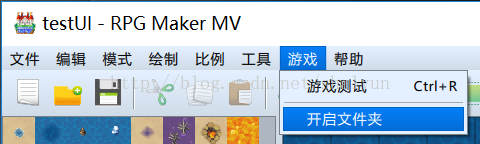
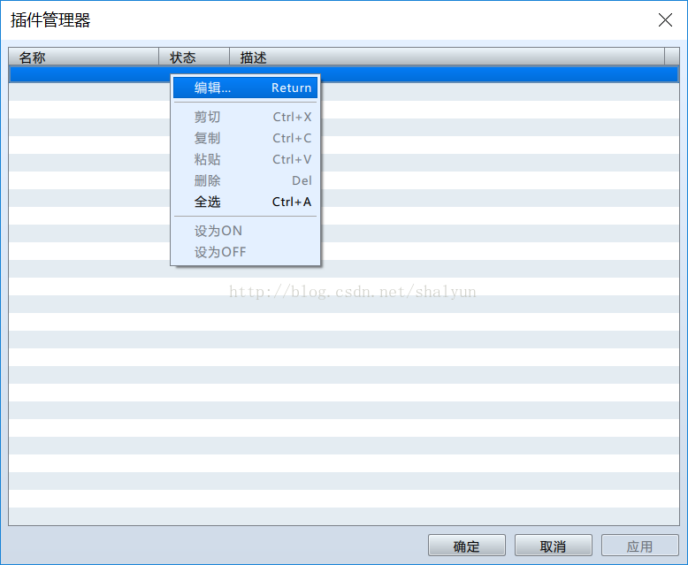
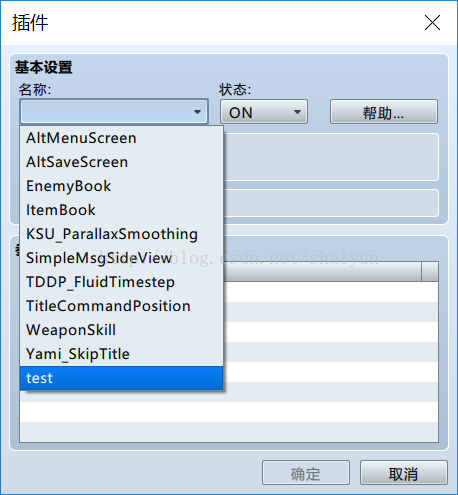
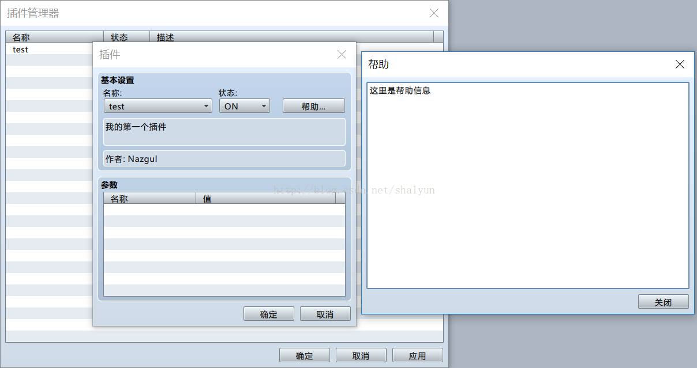

# 01 制作一个插件

打开RPGMakerMV，新建一个项目，在菜单栏中找到``游戏→开启文件夹``

此时会打开新建的项目的文件夹内，选择``js\plugins\``文件夹，
在这里面新建一个文件``test.js``，用你习惯的工具打开，输入以下代码：
```
//=============================================================================
// test.js
//=============================================================================
 
/*:
 * @plugindesc 我的第一个插件
 * @author Nazgul
 *
 * @help
 * 
 * 这里是帮助信息
 *
 */
```
以上代码是声明插件的信息，在游戏运行过程中不会执行，关键点在这里：

+ @plugindesc 插件名称
+ @author 插件作者（你的名字）
+ @help 从help之后直接注释块结束，都是插件帮助

保存文件，在RPGMaker中选择``工具→插件管理``，打开以下界面：

在第一行右键→编辑（或直接双击第一行），可以看到以下界面：

在名称组合框中，选择刚才新建的插件“test”，可以看到刚才声明的插件信息都显示在界面中了：

另外有几个说明：
+ 状态：ON表示开启，OFF表示关闭（不生效）
+ 帮助：点击后打开帮助信息（上面代码中@help后面的所有信息）
+ 参数部分后面单独说吧
