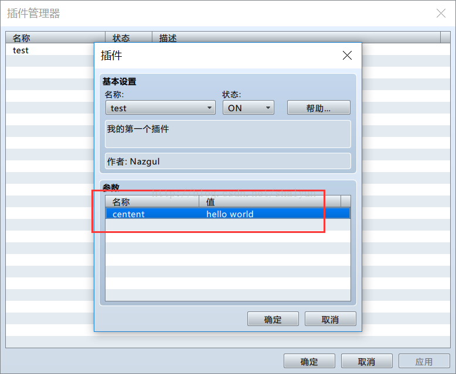
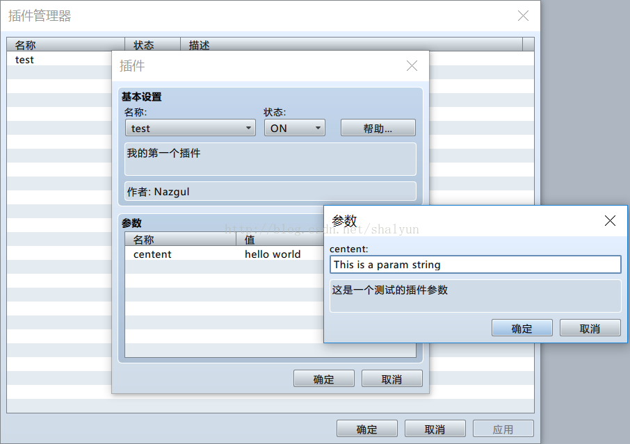
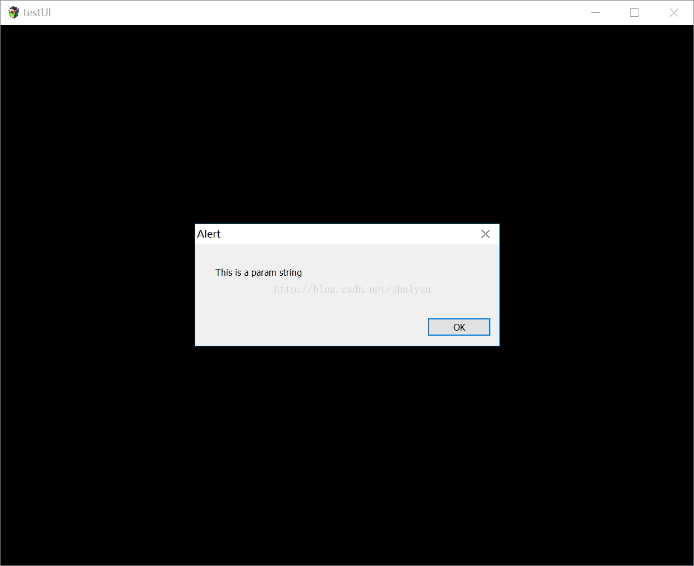

# 02 插件的参数定义
回顾上一节，我们创建了一个``test.js``文件，对应的插件名称就是test，
我们定义了插件的名称，作者与帮助信息，这节讲一下如何定义插件的参数并且通过js代码获得参数

还是接着上一节的js文件，在定义作者与帮助信息之间，增加这样三行：
```
 * @param centent
 * @desc 这是一个测试的插件参数
 * @default hello world
```
这样就定义了一个插件的参数，关键点如下：
+ @param 参数的名称
+ @desc 此参数的描述
+ @default 默认值

保存js文件，打开RPGMaker的插件管理界面，就能看到刚才定义的参数了：


双击参数名称或参数值，可以修改这个参数。


在js中，我们需要获得在插件管理器中设置的值，如何获得呢？在注释块外增加两行代码：
```
var MyParameters = PluginManager.parameters('test');
alert(MyParameters.centent);
```

解释一下：
+ ``PluginManager``是RPGMaker提供的插件管理类，``PluginManager.parameters``方法可以获得指定插件中所有插件参数对象（``test``是插件名）
+ 获得此对象后，将这个对象赋给``MyParameters``，此后，``MyParameters``就代表``test``插件的参数了
+ alert是弹出一个对话框，对话框的内容是MyParameters对象中的centent这个参数的值

好了，现在我们保存一下，运行游戏，可以得到以下结果：


可以看到，游戏成功弹出对话框，而对话框的内容正好是我们设置的centent的值。

（PS：为什么背景是黑框？因为插件在加载时就弹出了对话框，而这个时候游戏还没有加载完全，
所以背景是黑色的，同时我们弹出来的对话框是模式窗口，也就是说在这个弹框关闭之前js代码不会往下执行，
所以只要关闭对话框就可以恢复正常。当然这种写法是很有问题的，这里只是让大家了解如何获得参数的值才使用这种写法）

如果需要定义多个参数时怎么办呢？只需要在定义作者与帮助信息之间插入即可：
```
 * @param centent1
 * @desc 这是第一个测试的插件参数
 * @default hello world
 *
 * @param centent2
 * @desc 这是第二个测试的插件参数
 * @default hello world
```
而调用的方法也是一样：
```
var MyParameters = PluginManager.parameters('test');
alert(MyParameters.centent1);
alert(MyParameters.centent2);
```
另外，参数名称还支持包含空格，如以下代码：
```
 * @param This is centent3
 * @desc 这是第三个名称带空格的测试的插件参数
 * @default hello world
```
注意在这种情况下，使用``MyParameters.This is centent3``来访问插件参数将会报错，这个时候我们需要换一种访问方法
```
var MyParameters = PluginManager.parameters('test');
alert(MyParameters.centent1);
alert(MyParameters.centent2);
alert(MyParameters["This is centent3"]);
```
当然上面的``MyParameters.centent1``写成``MyParameters["centent1"]``也是一样的

以上就是插件参数的定义与从js中获取在RPGMaker设置的值的方法，下面是全部代码：
```
//=============================================================================
// test.js
//=============================================================================
 
/*:
 * @plugindesc 我的第一个插件
 * @author Nazgul
 *
 * @param centent1
 * @desc 这是第一个测试的插件参数
 * @default hello world
 *
 * @param centent2
 * @desc 这是第二个测试的插件参数
 * @default hello world
 *
 * @param This is centent3
 * @desc 这是第三个名称带空格的测试的插件参数
 * @default hello world
 *
 * @help
 * 
 * 这里是帮助信息
 *
 */

var MyParameters = PluginManager.parameters('test');
alert(MyParameters.centent1);
alert(MyParameters.centent2);
alert(MyParameters["This is centent3"]);
 ```
