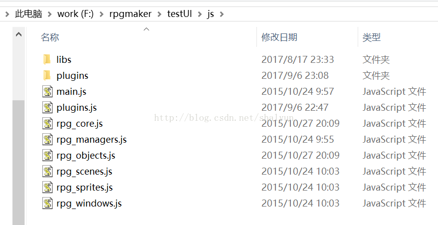

# 如何重写方法
插件其实就是对游戏的修改或扩展，用得6了也可以实现一些高大上的效果，
当然路要一步一步走，本节讲的是怎么重写（也就是修改啦）RPGMaker提供的方法

在讲解之前，我们先看一下工程目录下的js文件夹：

可以看到这里有很多``.js``的文件，这些文件就是游戏的源代码（没错就是源代码），
如果我们想要扩展游戏功能，就需要了解这些源代码的结构，哪些方法写在哪个文件里，叫什么名字等等。

既然要了解，那我们就得打开看看，不过这里我还是不建议各位打开这些文件了，看了你会崩溃的，因为这里的文件都有几千行代码，而且没有注释！

当然了我们的脚步不会就此停止，因为有大神对此进行了翻译（虽然是机翻，但总比没有好上1000倍啊），我打包上传到某盘了，地址在文章末尾！

如此众多的代码，在短时间内要全部看完都很难，更不用说了解详细的细节了，但是路就得一步一步走，我们先打开rpg_scenes.js文件，拖到第292行，官方代码如下：

Scene_Title.prototype

未完待续..
