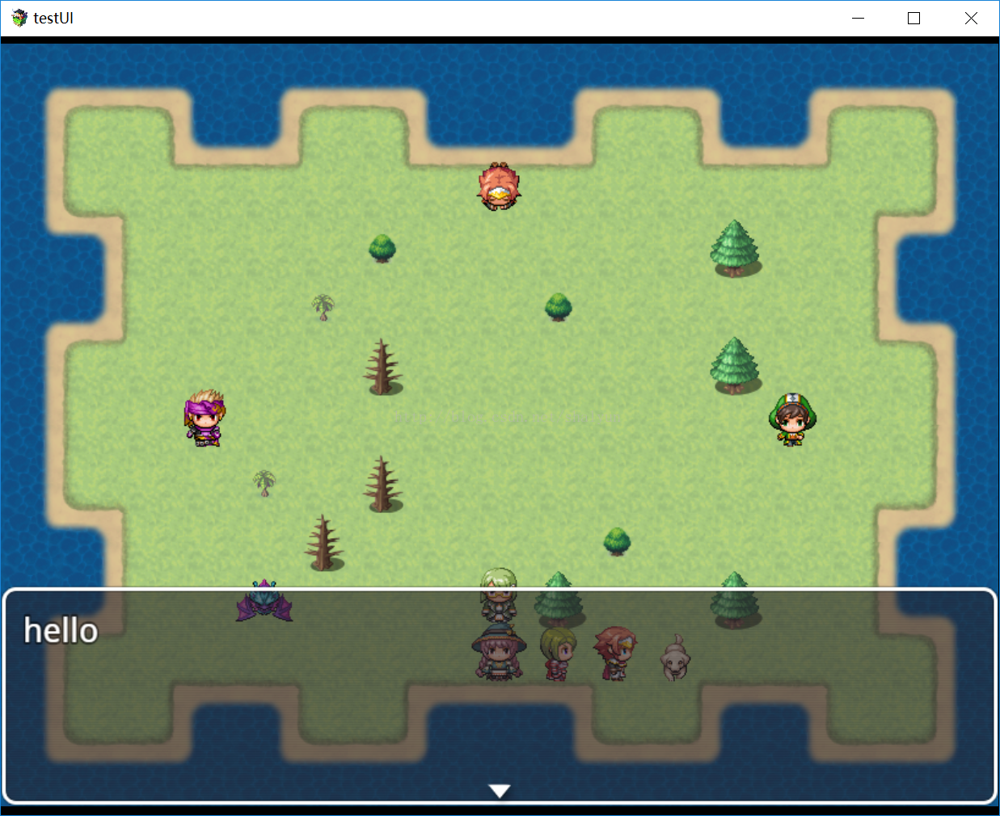

# 插件指令与脚本
## 简单的插件指令
插件指令与脚本是应用在RPGMaker事件流程中的，如果你在插件里自定义了一种行为，
那么可以通过插件指令来调用，脚本就更加灵活了，因为脚本里是直接可以编写js代码的。

当然自定义的函数也可以被脚本调用。

首先来了解一下插件指令，先新建一个``test.js``插件，在插件中插入以下代码：
```js
//处理插件指令
Game_Interpreter.prototype.pluginCommand = function(command, args){
    if(command == "test"){
        $gameMessage.add(args[0]);
    }
}
```

先解释一下这几行代码：
+ 第1行就是重写官方代码中的方法，
其实官方代码中这个方法是个空方法，也就是说这个方法本就是预留给插件开发者的
+ 第2行，判断command是不是等于字符串``test``，
``command``是方法的一个参数，也就是插件指令中的命令，命令是什么呢我们后面会讲。
+ 第3行，``$gameMessage``是游戏消息的对象，``add``就是加入一个消息，
消息的内容是``args``这个数组的第``0``号元素，``args``是插件指令的参数列表

好了，保存代码之后，把插件添加到插件管理器中。

在场景中新建一个事件，在右侧的事件执行内容中右键新增，打开后按下图操作：


可以看到我们在输入框中输入了``test hello``，这里的内容用空格格开，
空格前的``test``就是插件命令（可以翻上去看看第2行代码的解释）

空格后的``hello``就是插件指令的参数（可以翻上去看看第3行代码的解释），
当然了这里只有一个参数，如果需要多个参数就再用空格隔开就好了

确定后，运行游戏，去触碰事件，可以看到如下效果：


可以看到，插件指令的参数被当成消息显示出来了，可以在插件指令中修改其参数再来看看效果。

## 如何调用插件中定义的方法
这就是简单的插件指令的用法，接下来也简单说说脚本如何调用插件中定义的方法，在test.js里再加入如下代码：
```js
//脚本可以调用本方法
var test_fun = function(s){
    $gameMessage.add(s);
}
```

这里我们简单定义了一个方法，然后我们在事件中新建一个这样的内容：

保存后运行，与事件交互，可以看到效果：


另外在条件分支中还可以调用我们自己定义的方法，但是需要返回一个布尔值（true 或 false）
```js
//脚本返回值
var test_equal = function(a, b){
    return (a == b);
}
```

增加以上代码后，在事件中新增一个条件分支，如下图：

为每个分支也增加消息的输出：

我们看一下这个事件，由于我们条件是``test_equal(1, 1)``，
而上面我们新加的方法是判断两个参数是否相等，
所以可以看出来与事件交互时，应该会调用方法test_fun，也就输出消息“满足条件”，
运行一下看看效果是否如此：


可以看到运行结果与我们的期望相符，这时我们修改一下条件中的脚本：

这个时候1和2不相等了，所以应该会执行脚本指令，也就是输出消息“不满足”，运行看看效果：

好了，同样是符合我们的期望的

这就是插件指令与脚本的一些用法，可以帮助我们写出更多与玩家有真正交互的功能与特别的玩法
