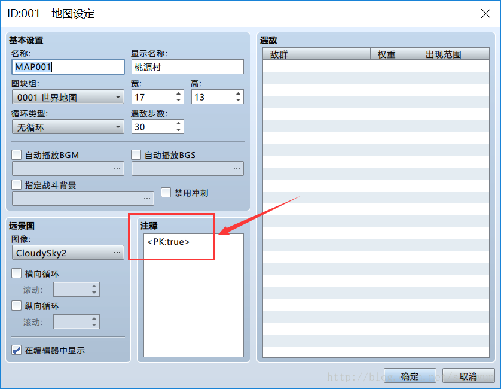
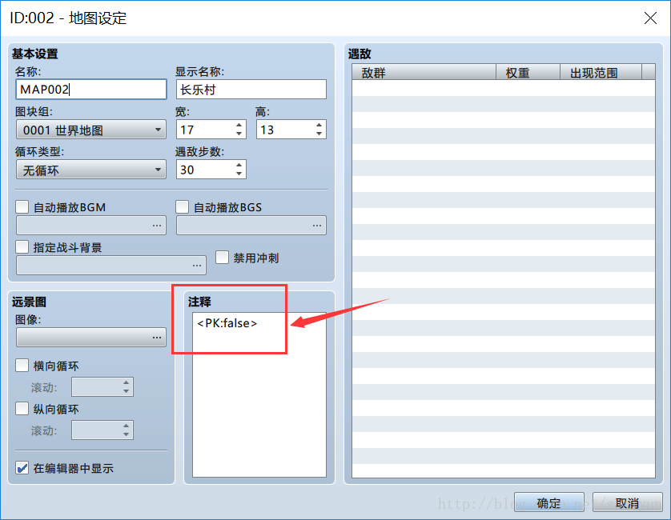
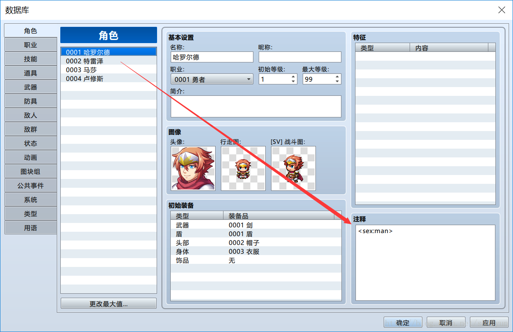

# 05 获得注释内容与IIFE
如果我们的插件只针对游戏中的某一部分地图、角色、职业、技能等，
并且针对不同的元素我们将有不同的处理的话，使用注释来定义新的功能是非常有用的。

什么是注释呢？我们打开一个项目，在地图列表中选择一个地图，右键->编辑，在打开的面板中输入以下信息：


我们在“注释”输入框中输入了``<PK:true>``并使用尖括号括起来，表示什么呢？
表示我们定义了一个名为``PK``的注释，而这个注释的值为``true``

我们再新建一个地图，在注释中输入以下信息：


设置完成后，我们新建一个插件，这里说一个题外话，
我们之前所有的插件名称都叫``test.js``，这样其实是很不好的，
建议大家以后可以根据``插件作者名缩写_插件名称.js``来为插件命名，比如现在我们命名为``Nazgul_metaTest.js``

头部对于插件名、作者、帮助信息的定义不再讲解，直接看代码部分：
```js
(function(){

    // 重写官方方法：当地图加载完成时
    var Scene_Map_onMapLoaded = Scene_Map.prototype.onMapLoaded;
    Scene_Map.prototype.onMapLoaded = function() {
        Scene_Map_onMapLoaded.call(this);  //调用官方原本定义的方法

        // 如果地图中定义了“PK”这个注释
        if ($dataMap.meta.PK) {
            alert($dataMap.meta.PK);
        }
    }

})()
```
需要注意的是我们这里与以前不一样的写法，就是我们写了一个``(function(){ ... })()``，这个是用来做什么的呢？

这是JS里的``IIFE``语法，即“立即执行函数”，也就是这个函数定义的同时立即执行了。

这时你可能有一个疑问：如果我按以前的写法，不也是立即执行的吗？
是的，按以前的写法同样是立即执行的，那么这里为什么要这样写呢，
因为这种写法有一个好处，就是变量不会全局化，
也就是如果万一你的插件定义的变量一不小心与别人的变量名相同，那么有一个变量就将会被覆盖，
所以在某些时候我们推荐这样的写法。

接下来我们解释一下上面的代码：
前3行即我们前面讲过的，重写官方方法并调用官方原本定义的方法
接下来我们判断地图中是否定义了PK这个注释，可以直接使用``$dataMap.meta.PK``，
``$dataMap``表示当前地图的引用，如果这个值是null，表示地图中并没有定义这个值，
那么``if($dataMap.meta.PK)``将判断不通过，if语句块里的代码就不会被执行。

那么运行时会有什么效果呢？
+ 1. 当我们进入Map001时，会弹框内容为“true”
+ 2. 当我们进入Map002时，会弹框内容为“false”
+ 3. 当我们进入一个没有设置该注释的地图时，不会有弹框出现

我们在角色、技能、道具等地也可以使用注释，比如我们在角色列表中加入如下定义：


定义后可以在代码中使用``$dataActors[1].meta.sex``来获得角色1的注释“sex”。

这里有一个差别，上面的示例中，可以使用``$dataMap``表示当前地图的引用，
而这里则需要``$dataActors[1]``来表示具体某一个角色，
实际上``$dataMap[1]``或者``$dataMap["Map001"]``这样的引用都是无效的
