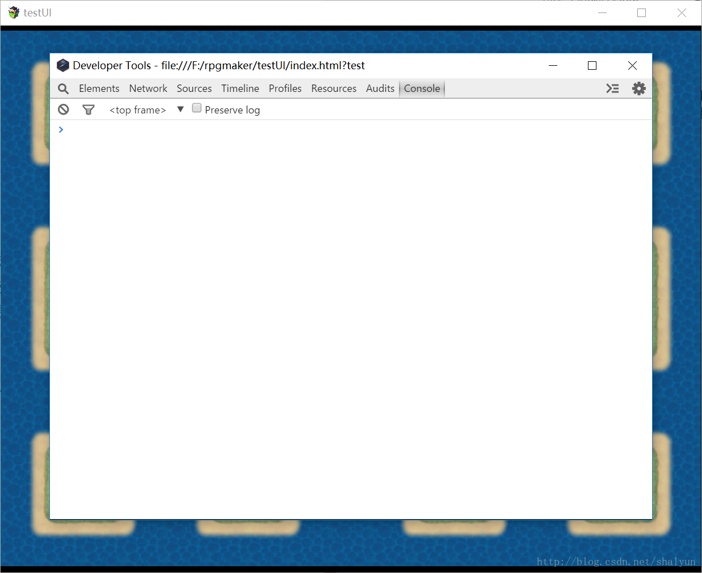
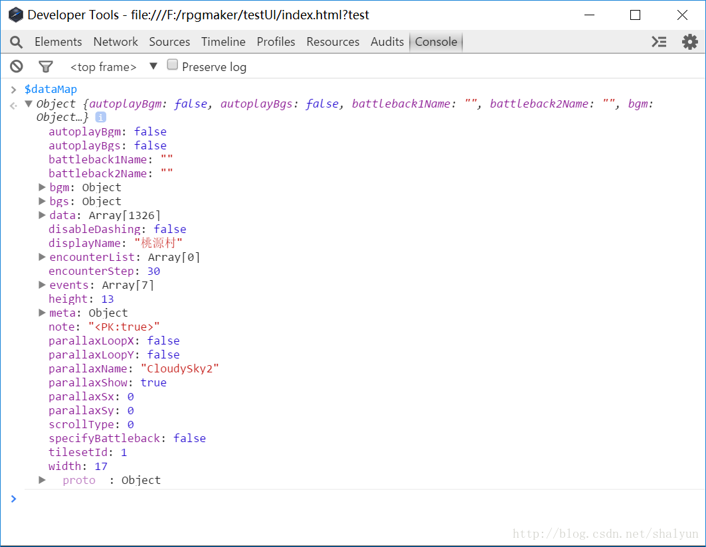
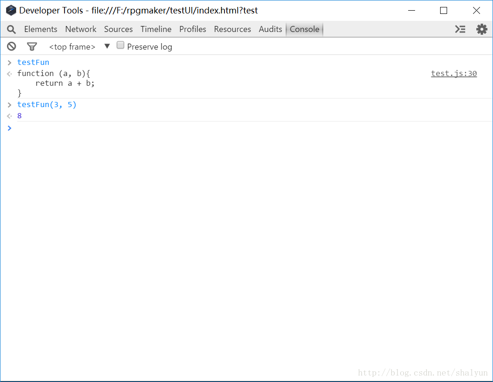

# 06：了解游戏数据与F8调试
随着对RMMV插件了解的深入，我们会发现如果我们想要对游戏数据进行一些扩展，
首先要了解游戏数据，游戏数据在官方代码中的``rpg_managers.js``里，
这一节我们将要对这个官方类有一些基础的了解，并且我们使用``F8``调试器来查看这些游戏数据。

打开``rpg_managers.js``，翻到第``14``行，可以看到以下代码：
```js
var $dataActors       = null;  //角色
var $dataClasses      = null;  //职业
var $dataSkills       = null;  //技能
var $dataItems        = null;  //物品
var $dataWeapons      = null;  //武器
var $dataArmors       = null;  //防具
var $dataEnemies      = null;  //怪物
var $dataTroops       = null;  //怪物群（就是一场战斗中会遇到的所有怪物的组合）
var $dataStates       = null;  //状态（buff）
var $dataAnimations   = null;  //动画
var $dataTilesets     = null;  //图块
var $dataCommonEvents = null;  //公共事件
var $dataSystem       = null;  //系统
var $dataMapInfos     = null;  //地图信息
var $dataMap          = null;  //地图
var $gameTemp         = null;  //临时数据
var $gameSystem       = null;  //系统
var $gameScreen       = null;  //场景
var $gameTimer        = null;  //计时器
var $gameMessage      = null;  //游戏消息（可以理解成对话框，第4节讲到过）
var $gameSwitches     = null;  //游戏开关
var $gameVariables    = null;  //游戏变量
var $gameSelfSwitches = null;  //独立开关
var $gameActors       = null;  //游戏角色
var $gameParty        = null;  //游戏队伍
var $gameTroop        = null;  //游戏怪物群
var $gameMap          = null;  //游戏地图
var $gamePlayer       = null;  //玩家
```
在这些代码中:
+ ``$data``开头的是我们在RM编辑器中定义的数据
+ ``$game``开头的则表示在游戏运行过程中产生的实时数据。

二者有何区别，打个比方：
+ 我们定义了玩家从1级升到2级需要多少经验、2级升到3级需要多少经验，
这些数据就是在编辑器中定义的
+ 而当游戏者真实在游戏时，我们还需要记录玩家到底获得了多少经验值，
玩家的当前经验值就是记录在``$gameActors``中的。

上面的注释中是数据的简单说明，要了解详细的，
我们可以直接从调试信息中获得很多有用的信息，
首先运行游戏，点``新游戏``进入游戏中，再按``F8``打开调试窗口：



打开后，默认就选择了``console（控制台）``页签，我们直接在这里输入``$dataMap``，输入时可以看到有很方便的提示，
输入结束后，按``Enter``键，下方输出了``$dataMap``这个对象，可以点击向右的小三角展开：


在这里可以看到此对象的完整结构（还有上一节加的``<PK:true>``），我们可以根据名称来猜测意义。

输入``$dataMap.meta``，按Enter键，可以输出上一节讲的注释。

控制台还可以测试函数的调用，比如以下函数（写在一个插件里并引用此插件，注意此代码不能写在``(function(){ ... })()``中）：
```js
var testFun = function(a, b){
    return a + b;
}
```

然后在控制台中输入``testFun``，则会打印出这个函数的源代码，如果输入``testFun(3, 5)``，则会打印出函数的返回值


